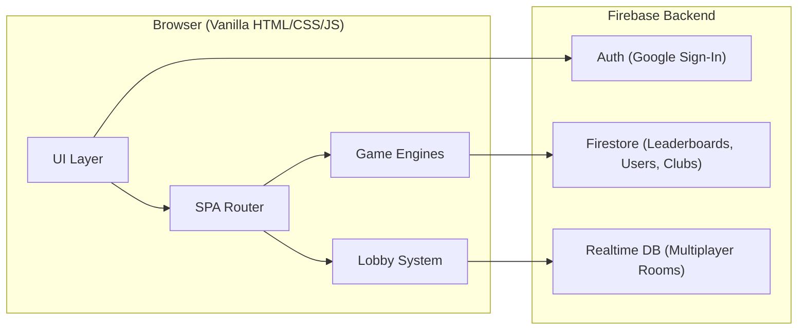

# RotaGame — Rotaract District 3191 Gaming & Engagement Platform

A premium, browser-based gaming platform where Rotaractors from District 3191 can play mini-games in **single-player or multiplayer**, compete on leaderboards, and foster inter-club engagement.

## Confirmed Decisions

| Decision | Choice |
|----------|--------|
| **Data Persistence** | Firebase Firestore (shared leaderboards) + Realtime DB (multiplayer rooms) |
| **Authentication** | Firebase Auth with Google Sign-In |
| **Club Management** | Admin panel to add/edit/remove clubs |
| **Branding** | Rotaract cranberry (#c3145b) + gold (#f7a81b) |
| **Game Modes** | Every game supports **Solo** + **Multiplayer** |
| **Deployment** | Netlify |

---

## Games (8 Total — All Solo + Multiplayer)

| # | Game | Solo Mode | Multiplayer Mode |
|---|------|-----------|-----------------|
| 1 | **🧠 Rota-Quiz** | Answer 10 questions, score = speed + accuracy | Live race — same questions, first to answer scores more |
| 2 | **🔤 Word Scramble** | Unscramble words in 60s | Race — same words, compete to solve faster |
| 3 | **🎴 Memory Match** | Find all pairs, fewer moves = higher score | Turn-based — alternate flipping, most pairs wins |
| 4 | **⚡ Speed Click** | Hit 30s of targets, score = total hits | Same challenge — both play, highest hits wins |
| 5 | **🐍 Rota-Snake** | Classic snake, score = length | Same challenge — both play, longest snake wins |
| 6 | **🔢 Math Blitz** | Solve problems in 60s | Race — same problems, fastest correct answers wins |
| 7 | **🔲 Sudoku** | Solve puzzle, score = speed × difficulty | Same puzzle race — first to complete wins |
| 8 | **❌ Tic Tac Toe** | Play vs AI (Easy/Medium/Hard) | Online turn-based — real-time against another player |

---

## Architecture Overview



---

## Project Structure

```
c:\Web & Tech\Rotagame\
├── index.html                      ← Single-page app shell
├── css/
│   ├── main.css                    ← Design system, variables, global styles
│   ├── components.css              ← Cards, modals, buttons, inputs
│   ├── games.css                   ← Game board styles (grids, canvas)
│   ├── lobby.css                   ← Room creation, waiting room styles
│   ├── leaderboard.css             ← Rankings, tables, badges
│   └── admin.css                   ← Admin panel styles
├── js/
│   ├── app.js                      ← SPA router, view manager, navigation
│   ├── firebase-config.js          ← Firebase init (Auth, Firestore, RTDB)
│   ├── auth.js                     ← Google Sign-In, session, role checks
│   ├── player.js                   ← Profile, club affiliation, stats
│   ├── leaderboard.js              ← 3 leaderboard views (game/club/player)
│   ├── admin.js                    ← Club CRUD, user management
│   ├── lobby.js                    ← Room system (create/join/matchmaking)
│   └── games/
│       ├── game-base.js            ← Base class: timer, scoring, mode switching
│       ├── quiz.js                 ← Rota-Quiz
│       ├── word-scramble.js        ← Word Scramble
│       ├── memory-match.js         ← Memory Match
│       ├── speed-click.js          ← Speed Click
│       ├── snake.js                ← Rota-Snake
│       ├── math-blitz.js           ← Math Blitz
│       ├── sudoku.js               ← Sudoku
│       └── tic-tac-toe.js          ← Tic Tac Toe
└── assets/
    └── images/                     ← Generated game icons, logos
```

---

## Proposed Changes (by Component)

### 1. Foundation & Design

#### [NEW] [index.html](file:///c:/Web%20%26%20Tech/Rotagame/index.html)
- Firebase SDK + Realtime Database SDK loaded via CDN
- Google Fonts (`Outfit`, `Inter`)
- SPA shell with view containers for: Login → Club Select → Dashboard → Game → Lobby → Leaderboard → Admin → Profile

#### [NEW] [main.css](file:///c:/Web%20%26%20Tech/Rotagame/css/main.css)
- Dark theme base (`#0a0a1a`), cranberry (`#c3145b`), gold (`#f7a81b`)
- Glassmorphism cards, gradient backgrounds, neon glows
- CSS custom properties for all colors, spacing, typography
- Keyframe animations: fade-in, slide-up, pulse, confetti

#### [NEW] [components.css](file:///c:/Web%20%26%20Tech/Rotagame/css/components.css)
- Buttons (primary, secondary, ghost), cards, modals, tabs
- Input fields, dropdowns, toggle switches (solo ↔ multiplayer)
- Avatar badges, rank indicators, notification toasts

#### [NEW] [games.css](file:///c:/Web%20%26%20Tech/Rotagame/css/games.css)
- Game board layouts (grids, canvas containers)
- Timer bars, score displays, countdown overlays
- Game-over screens with score breakdown

#### [NEW] [lobby.css](file:///c:/Web%20%26%20Tech/Rotagame/css/lobby.css)
- Room creation card, room code display
- Waiting room with player avatars
- "VS" matchup screen animation

#### [NEW] [leaderboard.css](file:///c:/Web%20%26%20Tech/Rotagame/css/leaderboard.css) + [admin.css](file:///c:/Web%20%26%20Tech/Rotagame/css/admin.css)
- Leaderboard tables with rank badges and row animations
- Admin panel layout: sidebar nav, data tables, forms

---

### 2. Firebase & Auth

#### [NEW] [firebase-config.js](file:///c:/Web%20%26%20Tech/Rotagame/js/firebase-config.js)
- Initialize Firebase App, Auth, Firestore, and **Realtime Database**
- Export shared instances for all modules

#### [NEW] [auth.js](file:///c:/Web%20%26%20Tech/Rotagame/js/auth.js)
- Google Sign-In popup → on first login, prompt club selection
- `onAuthStateChanged` listener for session persistence
- Admin role check via Firestore `users/{uid}.isAdmin`
- Sign-out and account switching

#### Firestore Schema

```
users/{uid}
├── displayName, email, photoURL
├── club: string (club doc ID)
├── clubName: string
├── totalPoints: number
├── gamesPlayed: number
├── joinedAt: timestamp
└── isAdmin: boolean

clubs/{clubId}
├── name, shortName, city
├── memberCount: number
├── totalPoints: number
└── createdAt: timestamp

scores/{scoreId}
├── playerId, playerName
├── clubId, clubName
├── game: string
├── score: number
├── mode: "solo" | "multiplayer"
├── timestamp: timestamp
└── metadata: { difficulty, moves, opponent, etc. }
```

#### Realtime Database Schema (Multiplayer Rooms)

```
rooms/{roomCode}
├── game: string
├── hostId: string
├── hostName: string
├── guestId: string | null
├── guestName: string | null
├── status: "waiting" | "playing" | "finished"
├── createdAt: number
├── gameState: { ... game-specific shared state ... }
├── hostReady: boolean
├── guestReady: boolean
└── result: { winnerId, hostScore, guestScore }
```

---

### 3. Multiplayer Lobby System

#### [NEW] [lobby.js](file:///c:/Web%20%26%20Tech/Rotagame/js/lobby.js)
- **Create Room:** Generate a 6-character room code, write to RTDB
- **Join Room:** Enter code, validate room exists and has space
- **Waiting Room:** Real-time listener for opponent joining, show both player cards
- **Ready Up:** Both players mark ready → game starts simultaneously
- **Disconnect Handling:** If a player disconnects, notify opponent, option to claim win
- **Auto-cleanup:** Rooms older than 1 hour are deleted

Flow:
```
Select Game → Choose Mode (Solo / Multiplayer)
                              ↓
                    Create Room  OR  Join Room
                              ↓
                      Waiting Room (VS screen)
                              ↓
                    Both Ready → Game Starts
                              ↓
                    Game Over → Scores Compared
                              ↓
                    Results → Rematch or Exit
```

---

### 4. Game Base Class

#### [NEW] [game-base.js](file:///c:/Web%20%26%20Tech/Rotagame/js/games/game-base.js)
Every game extends this base:
- **Mode toggle:** Solo vs Multiplayer
- **Timer management:** Start, pause, display countdown
- **Score tracking:** Calculate and submit to Firestore
- **Multiplayer sync:** Read/write game state to RTDB room
- **Game lifecycle:** `init()` → `start()` → `update()` → `end()` → `submitScore()`
- **Results screen:** Score breakdown, opponent comparison (if multiplayer), play again button

---

### 5. Individual Games

#### [NEW] [quiz.js](file:///c:/Web%20%26%20Tech/Rotagame/js/games/quiz.js)
- 10 questions, 15s each, 4 options
- **Solo:** Score = speed bonus + correctness
- **Multi:** Same questions synced — first correct answer gets bonus points
- Question bank: 100+ Rotary/general knowledge questions

#### [NEW] [word-scramble.js](file:///c:/Web%20%26%20Tech/Rotagame/js/games/word-scramble.js)
- Rotary-themed word bank, 60s timer
- **Solo:** Score = words solved
- **Multi:** Same words — race to unscramble, each word claimed by first solver

#### [NEW] [memory-match.js](file:///c:/Web%20%26%20Tech/Rotagame/js/games/memory-match.js)
- 4×4 grid (8 pairs), Rotary-themed card faces
- **Solo:** Score = pairs ÷ moves × time bonus
- **Multi:** Turn-based — flip 2 cards per turn, most pairs wins

#### [NEW] [speed-click.js](file:///c:/Web%20%26%20Tech/Rotagame/js/games/speed-click.js)
- Targets appear randomly, 30s round
- **Solo:** Score = total hits
- **Multi:** Same target pattern — both play, compare hits at end

#### [NEW] [snake.js](file:///c:/Web%20%26%20Tech/Rotagame/js/games/snake.js)
- Canvas-based, keyboard + touch controls
- **Solo:** Score = snake length
- **Multi:** Both play separately with same food pattern — longest snake wins

#### [NEW] [math-blitz.js](file:///c:/Web%20%26%20Tech/Rotagame/js/games/math-blitz.js)
- Random arithmetic, 60s timer, difficulty ramps up
- **Solo:** Score = correct answers
- **Multi:** Same problems — race, first correct answer scores

#### [NEW] [sudoku.js](file:///c:/Web%20%26%20Tech/Rotagame/js/games/sudoku.js)
- Backtracking generator, 3 difficulty levels
- Notes mode, undo, hints (cost points)
- **Solo:** Score = speed × difficulty multiplier
- **Multi:** Same puzzle — first to complete correctly wins

#### [NEW] [tic-tac-toe.js](file:///c:/Web%20%26%20Tech/Rotagame/js/games/tic-tac-toe.js)
- Smooth X/O animations, winning line highlight
- **Solo:** vs AI (Easy = random, Medium = heuristic, Hard = minimax)
- **Multi:** Real-time turn-based via RTDB, best-of-3 option

---

### 6. Leaderboard & Admin

#### [NEW] [leaderboard.js](file:///c:/Web%20%26%20Tech/Rotagame/js/leaderboard.js)
- **By Game:** Top 10 per game (filterable: solo / multiplayer / all)
- **By Club:** Aggregate club scores, ranked
- **By Player:** Overall total points
- Real-time updates via Firestore `onSnapshot`
- Time filters: All Time / This Month / This Week
- Animated rank badges 🥇🥈🥉

#### [NEW] [admin.js](file:///c:/Web%20%26%20Tech/Rotagame/js/admin.js)
- **Club CRUD:** Add, edit, delete clubs
- **User Management:** View players, assign admin roles
- **Stats Dashboard:** Total players, games played, most active club
- Access restricted to `isAdmin: true` users

---

## Build Order

| Phase | What | Files |
|-------|------|-------|
| **1. Foundation** | Design system, HTML shell, SPA router | `main.css`, `components.css`, `index.html`, `app.js` |
| **2. Auth & Data** | Firebase setup, Google Sign-In, player profiles | `firebase-config.js`, `auth.js`, `player.js` |
| **3. Solo Games** | All 8 games in single-player mode | `game-base.js`, all `games/*.js`, `games.css` |
| **4. Multiplayer** | Lobby system, room management, sync each game | `lobby.js`, `lobby.css`, update all games |
| **5. Leaderboard** | 3 views, real-time, filters | `leaderboard.js`, `leaderboard.css` |
| **6. Admin** | Club management, user roles, stats | `admin.js`, `admin.css` |
| **7. Polish** | Animations, responsive, confetti, deploy | All files, Netlify config |

---

## Verification Plan

### Manual Verification
- Google Sign-In → club selection → dashboard flow
- Play all 8 games in **solo mode**, verify scores save to Firestore
- Create multiplayer room → share code → second player joins → play game → scores compared
- All 3 leaderboard views show correct, real-time data
- Admin: add/edit/delete clubs, assign admin roles
- Responsive: test on mobile viewports (375px, 768px)
- Disconnect during multiplayer: opponent notified

### Deployment
- Deploy to Netlify
- Verify Firebase Auth works with Netlify domain
- Test with multiple simultaneous users

> [!TIP]
> **Firebase Setup Required:** Before building, create a Firebase project at [console.firebase.google.com](https://console.firebase.google.com/) and enable:
> 1. **Authentication** → Google provider
> 2. **Cloud Firestore** → Start in test mode
> 3. **Realtime Database** → Start in test mode
> 4. Copy the config object — I'll plug it into `firebase-config.js`
